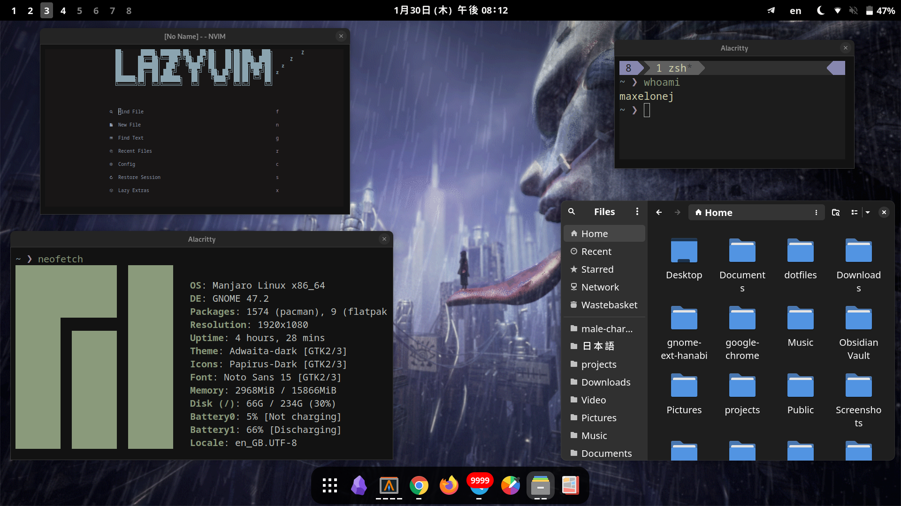

## <samp><b>My comfy developer workflow</b></samp>



| task                | name                                                    |
| ------------------- | ------------------------------------------------------- |
| operating system    | [manjaro](https://manjaro.org/)                         |
| desktop environment | [gnome](https://help.gnome.org/)                        |
| terminal            | [alacritty](https://wiki.archlinux.org/title/Alacritty) |
| shell               | [zsh](https://wiki.archlinux.org/title/Zsh)             |
| code editor         | [neovim](https://github.com/neovim/neovim)              |

zsh add-ons: [zinit](https://github.com/zdharma-continuum/zinit), [powerlevel10k](https://github.com/romkatv/powerlevel10k), [syntax-highlighting](https://github.com/zsh-users/zsh-syntax-highlighting/tree/master), [auto suggestions](https://github.com/zsh-users/zsh-autosuggestions), [completions](https://github.com/zsh-users/zsh-completions), [fzf tab](https://github.com/Aloxaf/fzf-tab)

[gnome exts](https://extensions.gnome.org/):

- user exts: [window thumbnails](https://extensions.gnome.org/extension/6816/wtmb-window-thumbnails), [hanabi](https://github.com/jeffshee/gnome-ext-hanabi), [OpenWeather Refined](https://extensions.gnome.org/extension/6655/openweather/)
- system exts: [AppIndicator and KStatusNotifierItem Support](https://github.com/ubuntu/gnome-shell-extension-appindicator), [Dash to Dock](https://micheleg.github.io/dash-to-dock/), [Gnome 4x UI Improvements](https://github.com/axxapy/gnome-ui-tune?tab=readme-ov-file), [Gtk4 Desktop Icons NG (DING)](https://gitlab.com/smedius/desktop-icons-ng), [Native Window Placement](https://gitlab.gnome.org/GNOME/gnome-shell-extensions), [Removable Drive Menu](https://gitlab.gnome.org/GNOME/gnome-shell-extensions), [Space Bar](https://github.com/christopher-l/space-bar)

[wallpaper](./assets/amegakure.gif) - [author](https://www.artstation.com/artwork/6gPox)

### <samp><b>Setup</b></samp>

1. Install packages

Arch

```bash
sudo pacman -S git lazygit alacritty zsh stow neovim eza bat fzf fd ripgrep zoxide lua51 luarocks npm pandoc
sudo npm install -g live-server
```

Ubuntu

```bash
sudo apt install git alacritty zsh stow neovim eza bat fzf fd-find ripgrep zoxide tmux
```

Ubuntu lazygit installation

```sh
LAZYGIT_VERSION=$(curl -s "https://api.github.com/repos/jesseduffield/lazygit/releases/latest" | \grep -Po '"tag_name": *"v\K[^"]*')
curl -Lo lazygit.tar.gz "https://github.com/jesseduffield/lazygit/releases/download/v${LAZYGIT_VERSION}/lazygit_${LAZYGIT_VERSION}_Linux_x86_64.tar.gz"
tar xf lazygit.tar.gz lazygit
sudo install lazygit -D -t /usr/local/bin/
```

2. Optional: Backup directories that will be changed (if you want to stow all dotfiles)

```bash
cd $HOME
mkdir -p .backup_config/.config
mv .zshrc .backup_config/
mv .p10k.zsh .backup_config/
mv .tmux.conf .backup_config/
mv .config/alacritty.toml .backup_config/.config/
mv .config/neofetch .backup_config/.config/
mv .config/alacritty .backup_config/.config/
mv .config/nvim .backup_config/.config/
```

3. Clone this dotfiles repo and [stow](https://github.com/aspiers/stow) them

```sh
cd $HOME
git clone https://github.com/maxelonej/dotfiles.git
cd dotfiles
stow .
```

4. To make zsh plugins work, need to install zinit:

```sh
cd $HOME
bash -c "$(curl --fail --show-error --silent --location https://raw.githubusercontent.com/zdharma-continuum/zinit/HEAD/scripts/install.sh)"
```

5. After installing and reloading the shell, compile zinit via:

```sh
zinit self-update
```

6. To make tmux plugins work, need to install tpm and run installer:

```sh
git clone https://github.com/tmux-plugins/tpm ~/.tmux/plugins/tpm
cd ~/.tmux/plugins/tpm/scripts/
tmux source ~/.tmux.conf
./install_plugins.sh
```

#### <samp><b>Gnome</b></samp>

<a href="https://wiki.gnome.org/Design/OS/KeyboardShortcuts">Default Gnome keymaps</a>

Custom:

<ul>
  <li>Toggle fullscreen mode - F11</li>
</ul>

#### <samp><b>Neovim</b></samp>

<a href="https://tmuxcheatsheet.com/">Default Tmux keymaps</a>
<a href="https://vim.rtorr.com/">Default Vim keymaps</a>
<a href="https://www.lazyvim.org/keymaps">LazyVim keymaps</a>

Custom:

<ul>
  <li><code>jj</code> in insert mode for change mode to normal</li>
  <li><code>&lt;leader&gt;cp</code> for <code>:MarkdownPreview</code></li>
  <li><code>&lt;c-n&gt;</code> / <code>&lt;leader&gt;e</code> / <code>&lt;leader&gt;n</code> for <code>:Neotree float reveal toggle&lt;CR&gt;</CR></code> (explorer/file structure)</li>
  <li><code>&lt;leader&gt;l</code> for <code>:Lazy&lt;CR&gt;</code></li>
  <li><code>&lt;leader&gt;m</code> for <code>:Mason&lt;CR&gt;</code></li>
  <li><code>&lt;Tab&gt;</code> for <code>:bn&lt;CR&gt;</code> (next buffer)</li>
  <li><code>&lt;S-Tab&gt;</code> for <code>:bp&lt;CR&gt;</code> (previous buffer)</li>
</ul>
